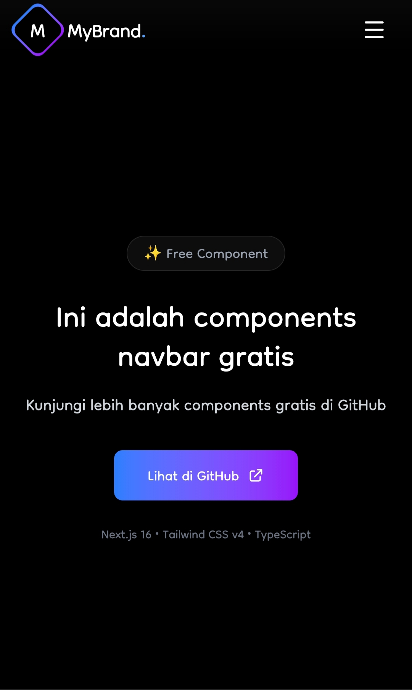
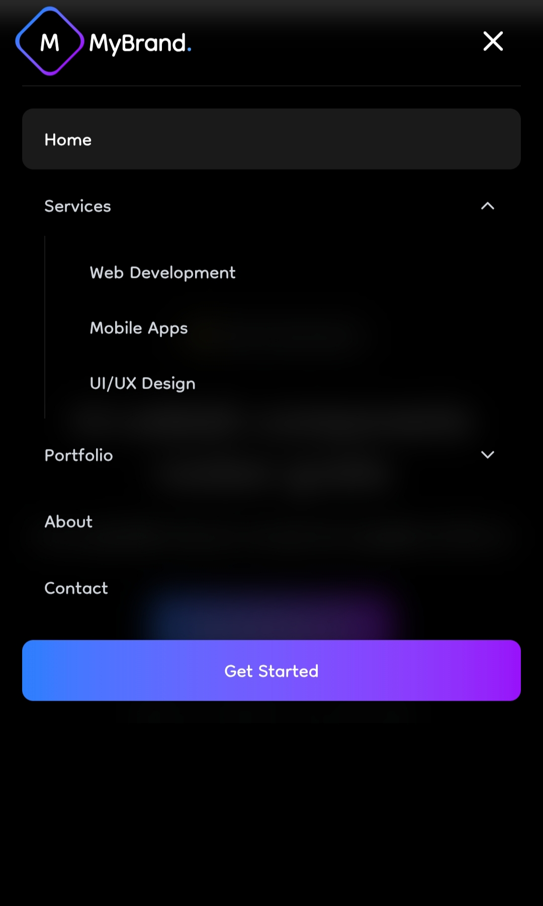

# 🚀 Navbar Component - Gratis

> Komponen **Navbar** modern, responsif, dan siap pakai untuk proyek Next.js Anda. **Gratis!**

---

## 🎨 Preview

### screenshot 1

### screenshot 2

---

## ✨ Fitur Navbar

| Fitur | Keterangan |
|-------|------------|
| **Fully Responsif** | Tampilan optimal di mobile, tablet, dan desktop |
| **Dark Theme** | Latar hitam dengan teks putih, tidak terpengaruh tema sistem |
| **Animasi Halus** | Efek hover, transisi dropdown, dan animasi hamburger |
| **Dropdown Menu** | Dukungan sub-menu dengan animasi scale & opacity |
| **Active State** | Indikator halaman aktif dengan garis bawah gradien |
| **Scroll Effect** | Navbar berubah saat discroll (blur & shadow) |
| **Logo + Teks** | Branding yang jelas dengan ikon dan nama |
| **Accessibility** | ARIA labels dan dukungan keyboard |
| **TypeScript** | Full type safety untuk pengembangan yang lebih aman |
| **Lucide Icons** | Ikon modern dan ringan |

---

## 📥 Cara Menggunakan

### 1. Salin Komponen
Buka file `Navbar.tsx` di repository ini, klik **Raw**, lalu salin seluruh kode.

### 2. Pindahkan ke Proyek
Buat folder `components/` jika belum ada, lalu tempel file `Navbar.tsx` di dalamnya.
